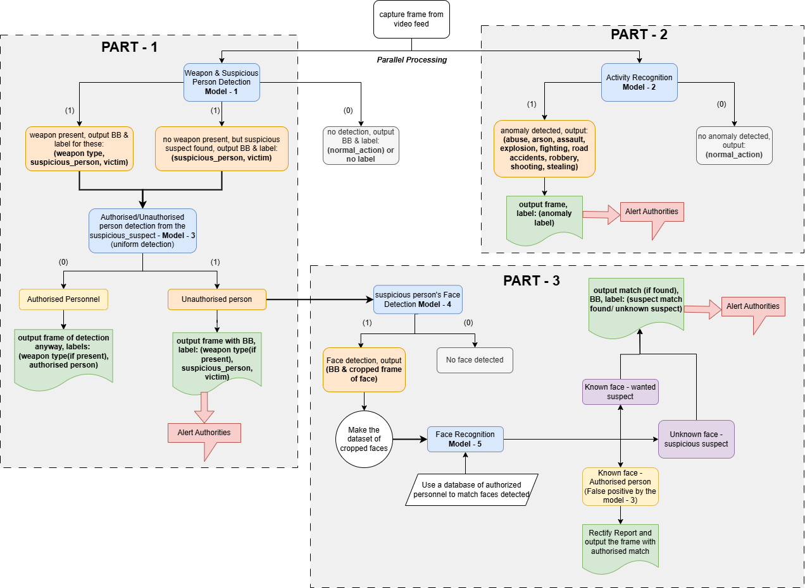

# project_defence
Real-Time Threat Detection in Military Surveillance Systems Using AI for Object, Activity, and Face Recognition

## Problem Statement
Develop an AI-powered surveillance system for real-time detection and recognition of potential threats, suspicious activities, and unauthorized individuals in restricted military zones. The system will be capable of identifying weapons, military vehicles, and drones, detecting suspicious behaviors, and recognizing faces to alert authorities of unauthorized personnel or threats.

## Dataset used for mark1 (mk1)
The dataset is collected from the following source:
"https://universe.roboflow.com/suspicious-movement/suspicious-detection/dataset/7"

It has the following classes:
names: ['normal-action', 'suspicious-suspect', 'victim', 'weapon']

total images used for training: 3,622
total images available for testing: 172

The final model is stored in:
"./mk1/runs/detect/custom_yolov8l2/weights/best.pt"

Real Time Detection:
Run the `real_time_detection.py` file to start the real time detection using the trained model.

## Ongoing development

PART 1: Object Detection (weapons detection and uniform detection) - in progress
PART 2: Activity Recognition (suspicious activity detection) - in progress
PART 3: Face Recognition (face detection and recognition) - not started

